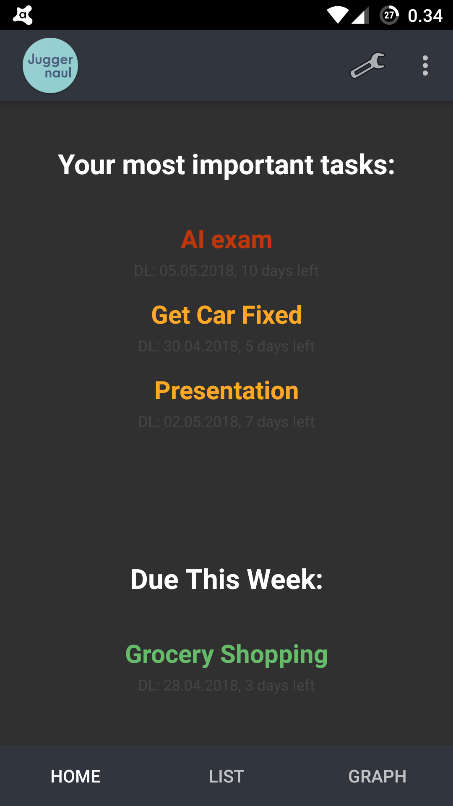

 

Juggernaul
======

Nail your tasks with Juggernaul, an android taskmanager app!  
Features:
  - Create tasks with DL, priority, category and description information
  - Create subtasks with priority colors for individual tasks
  - Export tasks to Google Calendar
  - Linear graph for comprehensive view of upcoming tasks
  - Home tab auto-suggests tasks, shows current week's tasks and more
  - Includes an android homescreen widget for quick glance of tasks
  
  
  

  
  

## Juggernaul V2.0 tasklist:
- [ ] Redo the app to use Firebase as db and backup
- [ ] Have in-progress icon scale according to subtasks / done_subtasks
- [ ] UI Refinements, especially the graph
- [ ] Group/sharing functionality